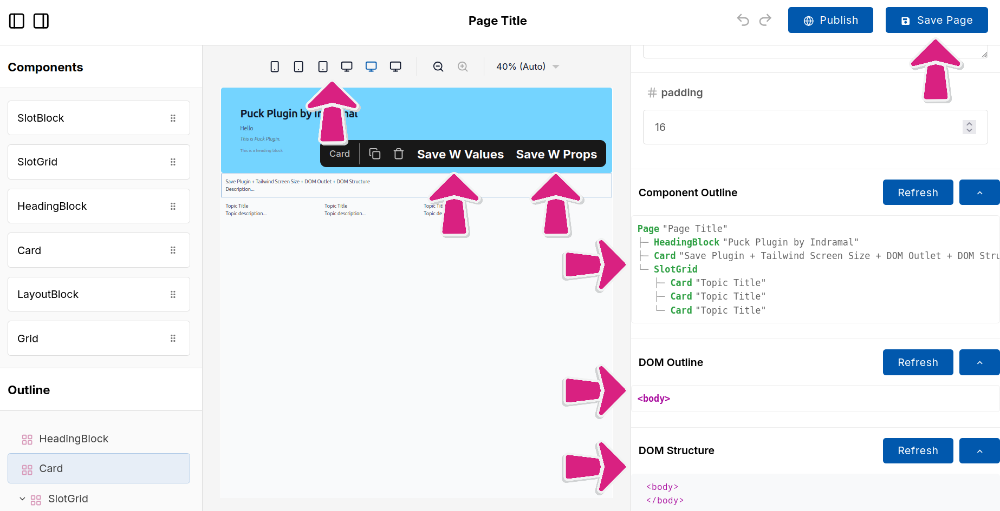
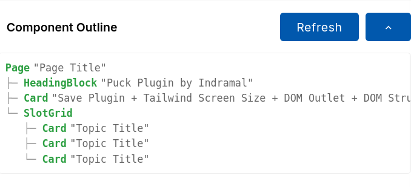
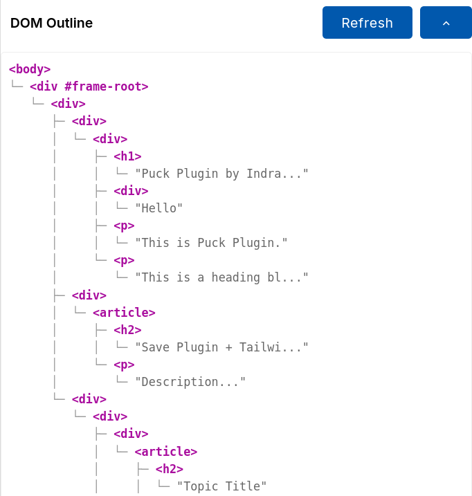
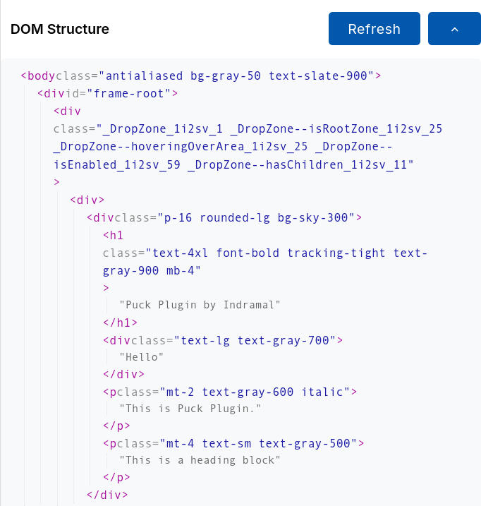

# Indra Save & Analyze Plugin for Puck

> **⭐ Give a Star to Support!**
> If you find this plugin useful, please give it a star on GitHub to support the author.
>
> **🤝 Contribute**
> If you like to contribute, please add a PR for this.

This plugin enhances the Puck editor by providing functionality to save pages and blocks as JSX files, adds powerful inspection tools to view the DOM structure and Component hierarchy directly within the editor interface, and integrates Tailwind CSS breakpoints.



## Features

- **Save Page as JSX**: Export the entire page layout as a React functional component.
- **Save Block as JSX**: Save individual blocks/components to reuse them.
- **DOM Structure (TreeView)**: View the real-time HTML DOM structure of the preview iframe.
- **DOM Outline**: A hierarchical outline view of the DOM.
- **Component Outline**: A tree view of your Puck component hierarchy/zones.
- **Tailwind Breakpoints**: Automatically provides standard Tailwind CSS breakpoints for the Puck viewport controls.

## Installation

Since this plugin is not available on NPM, you need to manually add the files to your project.

### Step 1: Add the Plugin File

Add the `Indra_save_plugin.jsx` file to your `app/` directory (or your preferred components folder).

### Step 2: Add the API Output File

Add the `api.save-jsx.tsx` file to your `app/routes/` directory. This file handles the file system operations needed to save your JSX files.

### Step 3: Register the Route

Open your `app/routes.ts` file and register the API route so the plugin can communicate with it.

```ts
import { route } from "@react-router/dev/routes";

export default [
  // ... existing routes
  route("api/save-jsx", "routes/api.save-jsx.tsx"), // <--- Add this line
  // ...
] satisfies RouteConfig;
```

> **Note**: The plugin expects the API to be available at `/api/save-jsx`. If you change this path, you must also update the `fetch` URL inside `Indra_save_plugin.jsx`.

## Prerequisites

- **Puck Editor**: This plugin is built for the [Puck](https://puckeditor.com/) visual editor.
- **Runtime**: Node.js environment (for file saving capabilities).


## Usage

Import the plugin and the breakpoint helper in your Puck editor route (usually `app/routes/puck.tsx` or `app/routes/puck-splat.tsx`).

### 1. configuration
Add the plugin to the `plugins` array and use `getScreenBreakpoints()` for the `viewports` prop.

```tsx
import { Puck } from "@measured/puck";
import IndraSavePlugin, { getScreenBreakpoints } from "../Indra_save_plugin";

// ...

function Editor() {
  return (
    <Puck
      config={config}
      data={data}
      // Inject Tailwind CSS breakpoints
      viewports={getScreenBreakpoints()} 
      plugins={[
        IndraSavePlugin({
          domoutline: true,       // Enable DOM Outline view
          domstructure: true,     // Enable DOM Tree Structure view
          componentoutline: true, // Enable Component Hierarchy view
          savepages: "components/puck/pages/",   // Path to save pages
          saveblocks: "components/puck/blocks/", // Path to save blocks
        }),
      ]}
      onPublish={savePage}
    />
  );
}
```

### 2. Configuration Options

| Option | Type | Description |
|--------|------|-------------|
| `domoutline` | `boolean` | Enable the DOM Outline view in the fields panel. |
| `domstructure` | `boolean` | Enable the DOM Structure (TreeView) in the fields panel. |
| `componentoutline` | `boolean` | Enable the Component Hierarchy outline in the fields panel. |
| `savepages` | `string` | Relative path (from `app/`) to save generated page JSX files. |
| `saveblocks` | `string` | Relative path (from `app/`) to save generated block JSX files. |

## How it Works

### Full Page Edit & Save
The plugin adds a "Save Page" button to the header. This generates a complete JSX file for your current layout.


### Component Outline
View your Puck data structure (Zones and Components) in a nested tree view. This helps visualize how your components are nested, especially when using Slots.



### DOM Outline
A clean, hierarchical representation of the actual HTML elements rendered in the iframe.



### DOM Structure
A detailed look at the raw DOM nodes within the preview frame, useful for debugging layout issues.



### Controls

Each outline view includes helper controls in the header:

- **Refresh**: Manually re-scans the DOM or Component tree. This is useful if the outline gets out of sync with dynamic content changes in the preview.
- **Collapse/Expand**: Toggles the visibility of the tree nodes to help you focus or save space.

## Troubleshooting

- **"Failed to save file"**: 
  - Ensure the directories you specified in `savepages` and `saveblocks` exist or that the server process has permissions to create them.
  - Check the server console for specific error messages from the Node.js `fs` module.
- **Route 404 / 405 Method Not Allowed**:
  - Verify that you correctly registered the route in `app/routes.ts`.
  - Ensure the route path matches exactly `/api/save-jsx`.
- **Styles missing in Outline**:
  - The plugin injects its own styles, but it relies on basics. If the outline looks broken, check if any global CSS is overriding default HTML styles for `<ul>` or `<li>` elements (though the plugin mainly uses `div`s with inline styles to be safe).

## Author 

- **Indramal Wansekara**
- [GitHub Repository](https://github.com/indramal/Indra-Save-and-Analize-Plugin-for-Puck-Editor/)
